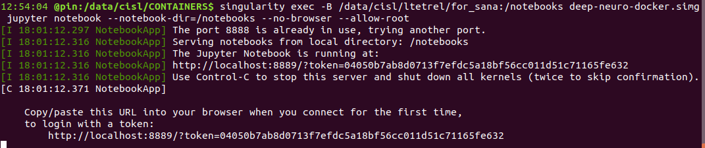

Containerized technology is one of the major change in scientific world.
It allows **reproducible**, **large-scale** and **burden-free environment setup** for science.
In the mean-time, jupyter notebook provides a **interactive coding session** and easy way to work on python environment.
You will learn how to launch your favourite **notebook** on a **remote server** (from CRIUGM, or computecanada) using a specialized container technology called **[singularity](https://singularity.lbl.gov/)**, which allows you to run containers without sudo rights.

### Connect to the desired server

1. open a cmd prompt

2. connect on `pin` (passwordless authentification is assumed)
```
ssh pin
```

### Upload your data in the server

1. upload he notebooks
```
rsync -rlt --info=progress2 <my_local_file> pin.criugm.qc.ca:~/path/where/you/want/<my_remote_file>
```

1. upload the database
```
rsync -rlt --info=progress2 <my_local_database> pin.criugm.qc.ca:~/path/where/you/want/<my_remote_database>
```
**Please ensure that the data is not already available somewhere on** `/data/cisl`

### Launch the container

1. go to `/data/cisl/CONTAINERS`
```
cd /data/cisl/CONTAINERS

```
2. run the singularity image
```
singularity exec -B ~/Documents/work/sana_notebooks/:/notebooks deep-neuro-docker.simg bash -c "source /etc/bash.bashrc" && jupyter notebook --ip '*' --no-browser --allow-root
```

### work on the notebook remotely !

1. open a new command prompt

2. Create a ssh tunnel so you can work on your browser locally (even if it is running remotely)
```
ssh -L 7777:localhost:7777 ltetrel@pin.criugm.qc.ca
```

3. You can now just open the link outputted by the container


*If you need other libraries for your application, it is possible to update the container.*

*Please ask to* : #ltetrel
